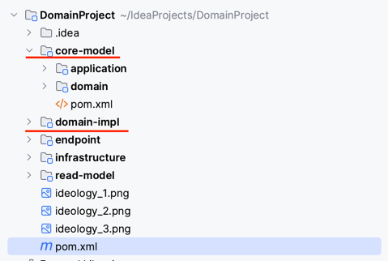
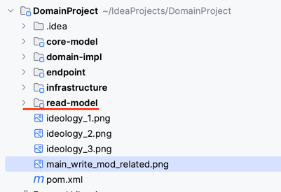

# BriefOfDomain

# Key Ideology
## 基于六边形结构

## 依赖流向

## 领域战术

# Main Mod
## write mod

## read mod

## Q&A
* 核心模块中实体耦合jpa框架的优劣?  
    * 好处是一定程度的减少代码编写  
    * 坏处是实体设计从此和表结构一定程度耦合,无法随心所欲的设计实体,要考虑表结构,字段,性能等  
      _在此举例说明下领域实体直接面向表对领域的限制(如由于接入JPA,直接在JPA的@Entity上设计领域实体)_  
        
      _面向领域设计领域实体和面向表设计领域实体(如因由于耦合的jpa等原因)的区别_  
          
      _面向表设计领域实体的其他限制_    
          若我们采用了面向表来设计实体,如采用了设计1,如若读服务因为某种原因需要优化读取,给Permission表加了冗余字段role_id(即变成了设计3),
      则这种改变会直接影响到领域层的设计,即富含业务知识的领域(业务)层因为技术上的改变而被改变,带上了技术复杂度.  
          而若采用面向业务关系的设计,领域(业务)层不需要感知这种变化,只要在实体和POJO转换的领域实现层([domain-impl](domain-impl),属于六边形外围的技术层)添加上字段转换即可,
      从而避免了领域耦合技术概念,并为技术优化改变实体设计的尴尬境地.    
      __故结论是最好不要采用核心模块中实体耦合jpa等技术框架__
  