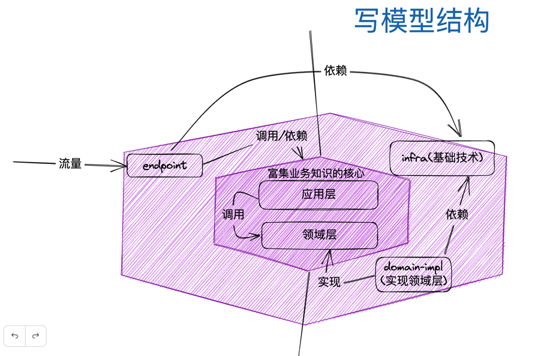
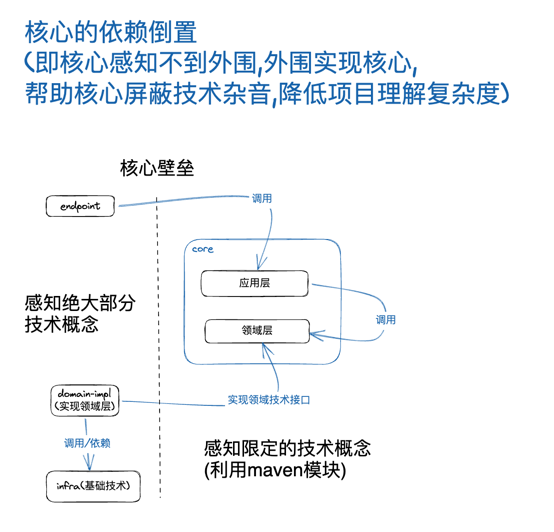
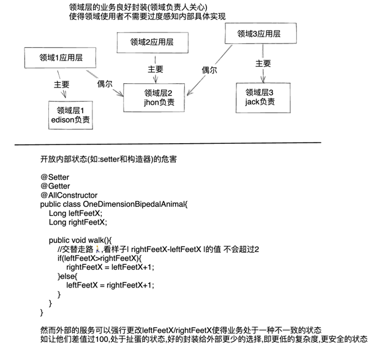
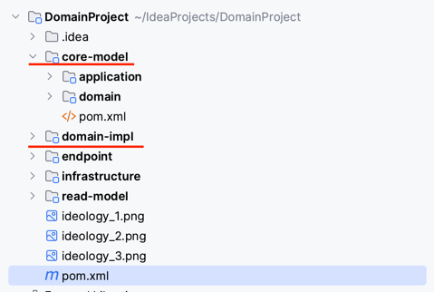
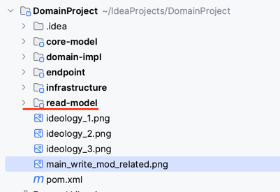

# BriefOfDomain

# Key Ideology
## 基于六边形结构

## 依赖流向

## 领域战术

# Main Mod
## write mod

## read mod

## Q&A
* 核心模块耦合jpa框架的优劣?  
    好处是一定程度的减少代码编写  
    坏处是实体设计从此和表结构一定程度耦合,无法随心所欲的设计实体,要考虑表结构,字段,性能等
