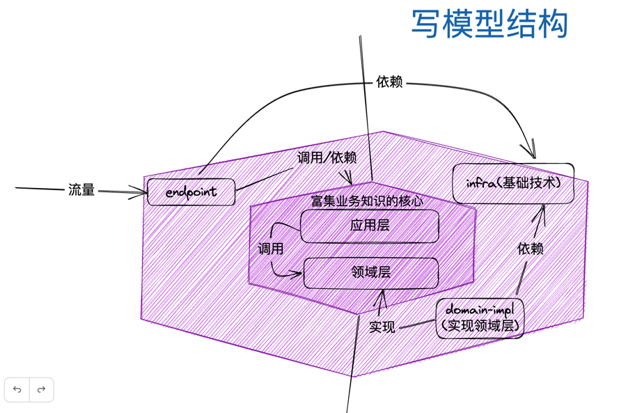
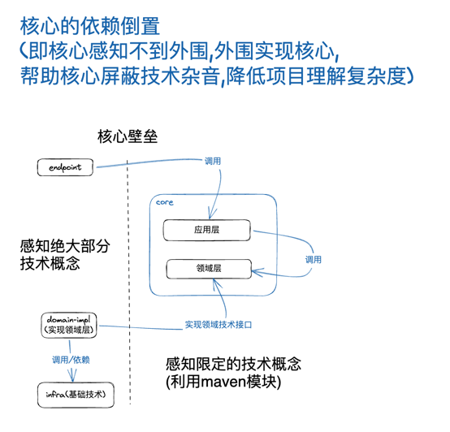
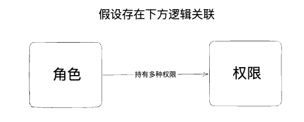
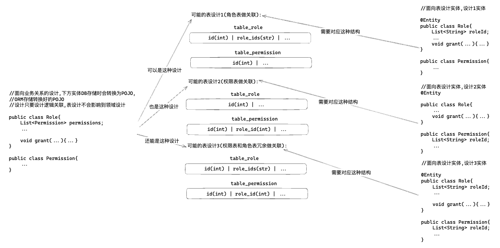
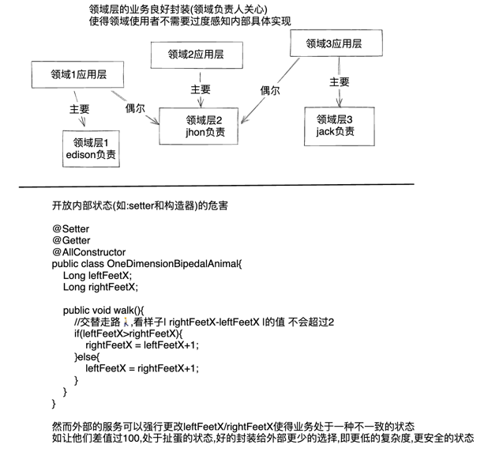

# 简言领域  
    基于包级别暴露的高内聚领域实践
# DDD目标
    降低/分割系统的复杂度,基于`人接受复杂度的能力有限`这一理论.
    通俗讲ddd本质上是一种`收纳整理`的方法论,整理的目标就是系统(技术&业务)的复杂度.
# DDD降低复杂度的手段
* 通用语言
  * 程序概念和业务术语的尽量一致,人脑就不用维护业务术语和程序代码的映射,从而减少复杂度
    * 例: 平常业务场景上的术语`给设备录入人脸`,在代码的实现可能是 `devicePanel.register(face)`,即`设备面板->注册(人脸)`,这种不一致迫使人脑维护了业务语言和代码实现的映射关系.更不幸的是,这种映射往往不会存留文档.
* 限界上下文
  * 将内聚业务划分壁垒(可以利用`包/maven模块/jar/进程`做壁垒),防止过多纠葛(多条复杂度如毛线般纠缠),从而限制复杂度发散
* 领域战术设计
  * 抽象领域中存在的共性概念,相应职责的类向其靠近,避免复杂度发散,具体战术概念如下:  
  聚合(aggregate), 实体(entity), 值对象(value object), 领域服务(domain service), 领域工厂(domain factory), 领域策略(domain policy), 
  领域仓储(domain repository), 领域事件(domain event), 领域异常(domain exception)等
* 利用六边形架构的内外层分割(分割了业务复杂度和技术复杂度,防止过度纠葛,限制复杂度发散)
  * 内层领域层
    * 内含(内聚)业务复杂度: 业务约束,概念
  * 外层技术层
    * 内含技术复杂度: 领域概念和技术pojo转换,mysql,redis等具体实现

# 模块说明
* __[主要]__ [core-model](core-model) 写(核心)模块,本质隶属领域(核心/业务知识)层,保证写一致性的模块
  * [application](core-model%2Fapplication) 应用(层)模块,领域模型调度层
  * [domain](core-model%2Fdomain) 领域(层)模块,领域模型定义层
* __[主要]__ [read-model](read-model) 读模块,本质隶属技术层,存放读模型(读服务)
* [endpoint](endpoint) 入口模块,如http,grpc,mq event receiver等
* [domain-impl](domain-impl) 实现领域模块,即调用具体技术实现领域层
* [infrastructure](infrastructure) 基础设施模块,如mysql,redis等pojo,dao实现

# 采用思想
## 基于六边形结构


## 依赖流向(核心模块的依赖倒置)
  
ps: 可以沿着上图箭头顺序快速走读代码


  
## Q&A  
### 为什么要用DDD,不用不行么?

* 用ddd是为了减少复杂度,如果当前项目复杂度不大,未来需求(即可预期的复杂度)也在可以控制的范围内,就可以不用ddd,
因为初期ddd的设计成本比较大(如上图所示,ddd是在高复杂度增效的),反而得不偿失
* 从ddd本身这个手段来讲,如果有其他手段和ddd定位相同,但能更高效的`降低系统的复杂度`,且避免了ddd的所有缺点,
我们完全可以`摈弃DDD(加强语气)`,因为`降低系统的复杂度`才是我们的最终追求(且铭记这句话,避免陷入教条主义),
但目前来看,采用ddd仍然是降低系统复杂度的一个强力手段  
### 核心(领域)模块是否要完全避免引入技术的依赖?
* 理想情况下,核心模块不引入技术,就可以完全避免业务复杂度和技术复杂度纠葛,从而使核心层的领域(业务)知识更加内聚,清晰.
然而现实情况并不如此简单,之于上方提出的问题,还是要围绕复杂度来讲,人是否能handle住核心层引入某些技术的复杂度,引入技术是否能为我们带来好处(如方便开发),
如引入spring,复杂度上来讲程序员都很熟悉,对代码侵入性不是太高(如使用注解),开发上也为我们带来了好处,那么就`可以考虑引入这种技术`(如引入注解部分),
然而这种核心层技术引入一定要团队把关,任何引入建议向全团队报备感知,引入要考虑如何引入最小部分依赖,通过后引入,
因为过低的引入依赖门槛必定导致核心层过多的引入技术概念,最终导致技术复杂度和业务复杂度纠缠,复杂度提升
(行之有效的办法是leader关注[core-model](core-model)下几个的pom.xml更改情况,如利用ci检测到文件更改时通知)
### 核心(领域)模块中实体耦合jpa框架的优劣?  
* 好处是一定程度的减少代码编写
* 坏处是实体设计从此和表结构一定程度耦合,无法随心所欲的设计实体,要考虑表结构,字段,性能等  
  _在此举例说明下领域实体直接面向表对领域的限制(如由于接入JPA,直接在JPA的@Entity上设计领域实体)_  
    
  _面向领域设计领域实体和面向表设计领域实体(如因由于耦合的jpa等原因)的区别_  
      
  _面向表设计领域实体的其他限制_    
  若我们采用了面向表来设计实体,如采用了设计1,如若读服务因为某种原因需要优化读取,给Permission表加了冗余字段role_id(即变成了设计3),
  则这种改变会直接影响到领域层([core-model](core-model))的设计,即富含业务知识的领域(业务)层([core-model](core-model))因为技术上的改变而被改变,带上了技术复杂度.  
  而若采用面向业务关系的设计,领域(业务)层([core-model](core-model))不需要感知这种变化,只要在实体和POJO转换的领域实现层([domain-impl](domain-impl),属于六边形外围的技术层)添加上字段转换即可,
  从而避免了需要保证一致性的领域层([core-model](core-model))耦合技术概念,并为技术优化改变实体设计的尴尬境地.    
  __故结论是最好不要采用核心模块中实体耦合jpa等技术框架__
### 为什么要封装领域,不能过度开放领域?

### 当性能优化和ddd战术概念冲突时我们该如何取舍?
* todo...利用抽象service做技术性优化...有条件的话尽量保持关键领域概念在领域内的抽象服务中,将具体事项委托给服务的实现来做...虽丧可能会失部分领域复杂度管控,但整体复杂度总和仍然可控...
### 拿捏不准何时定义ValueObject怎么办?
* 常见定义原则: todo...
* 躺平主义: todo...
### 何为内聚?
* 内聚,即描述一个概念集合之间有很强的关联性,关联性可以理解为,概念之间 __较多__ 引用和被引用,概念和概念之间共享同一批资料(数据).这些共享是的概念难以被分割,若强行分割了后期对内聚概念的改动将牵一发而动全身,全部分割概念都得改变.
  除此外,内聚的概念集合往往存在很多内部关联但不并需要暴露的概念;另,人们提到内聚时,往往是基于给定切入角度和前置上下文的.举个例子来说明
  * 从社会学的角度上来看,家庭有很强的内聚性,一个家庭很可能会共享家庭内部信息,财产,家庭子女和父母共享部分遗传信息(共享概念,资料),家庭成员往往难以分割,有很强的内聚性    
  * 从生物学的角度来看,人和人可以轻易分开生活,他们不用共享器官(共享概念,资料)这种与人身身体体现出高内聚的概念,家庭成员从生物学的角度切入就变得又能分割了.从外边看,感知不到内部器官(共享概念/资料,内部共享,外部不需要感知)也往往不需要暴露感知与操作(外部操作人的内部器官,这样对内聚概念不安全)    
__所以形容概念是否内聚,往往会给出一个相应的上下文,在一个上下文中内聚,可能在另一个上下文就不内聚了.又举例说,在一个系统中内聚的概念,在另一个系统中可能就不内聚了(因为另一个系统中的概念不再存在大量的概念引用与被引用或共享大量资料).__
### 为何要用利用一个包限定领域内概念，而不是按职责划分多个包?
* todo...因为限定上下文范围内概念高度内聚,内聚的概念内部常常存在引用和被引用,数据共享交换,好些概念与关联外部也不需要感知(包级别访问权限);
### 领域模型和数据库模型分离的好处?
* todo...
* serveless化友好

## 其他感知
### 使用ddd战术概念valueObject带来的测试优势
* 让我们假设一个业务场景,我们有一个消息发送系统可以给不同用户发送消息,其中消息的发送有时间限制
  ```
      发送周天: [x]周一 [x]周二 []周三 []周四 []周五 []周六 [x]周日
      发送时段: 10:00:00 ~ 20:59:59
  ```
  出于接口的需要我们要计算出发送消息的时间的下一个可用时间的时间戳.让我们取上方场景,用户指定周一,周二,周日,在10:00:00 ~ 20:59:59时段可以发送信息,
  如果消息触发的时间是周五,那么计算出来的时间戳应该是顺延最近周日10:00:00的时间戳.
  假设这段场景被设计为一个valueObject,那么可以如下设计  
  __定义代码__
  ```java
    public class PermitReceiveTime {
        List<DayOfWeek> permitWeekDays;//发送周天
        LocalTime permitDayTimeBegin;//发送时段开始
        LocalTime permitDayTimeEnd;//发送时段结束
      
        public PermitReceiveTime(Set<DayOfWeek> permitWeekDays, LocalTime permitDayTimeBegin, LocalTime permitDayTimeEnd) {
            //业务约束: permitDayTimeBegin要先于permitDayTimeEnd
            if (permitDayTimeEnd.isBefore(permitDayTimeBegin)) {
                throw new IllegalArgumentException("permitDayTimeEnd cant be before permitDayTimeBegin");
            }
            this.permitWeekDays = permitWeekDays.stream().sorted(Comparator.comparingInt(DayOfWeek::getValue)).collect(Collectors.toList());
            this.permitDayTimeBegin = permitDayTimeBegin;
            this.permitDayTimeEnd = permitDayTimeEnd;
        }
      
        /**
         * 计算下一个允许接受信息的时间点的时间戳,单位:ms
         *
         * @return
         */
        public long calcNextPermitTs() {
            OffsetDateTime now = OffsetDateTime.now();
            ZoneOffset offset = now.getOffset();
            //今天是否是允许接受消息的星期的天
            boolean isTodayPermitWeekDay = permitWeekDays.contains(now.getDayOfWeek());
            boolean isNowAfterPermitDayTimeBegin = now.toLocalTime().isAfter(permitDayTimeBegin);
            boolean isNowBeforePermitDayTimeEnd = now.toLocalTime().isBefore(permitDayTimeEnd);
            //现在是否是在允许接收消息的时段内
            boolean isNowPermitDayTime = isNowAfterPermitDayTimeBegin && isNowBeforePermitDayTimeEnd;
            if (isTodayPermitWeekDay && isNowPermitDayTime) {
                //现在是 允许接受消息的星期的天 和 允许接收消息的时段内 直接返回当前Ts
                return System.currentTimeMillis();
            }
            //下一个允许接受信息的weekday距离输入参数now的间隔天数
            int nextPermitWeekDays = calcNextPermitWeekDays(now.getDayOfWeek(), now.toLocalTime());
            return permitDayTimeBegin.atDate(now.toLocalDate().plusDays(nextPermitWeekDays)).toInstant(offset).toEpochMilli();
        }
      
        /**
         * 计算下一个允许接受信息的weekday距离输入参数now的间隔天数
         *
         * @param todayOfWeek
         * @param todayLocalTime
         * @return
         */
        int calcNextPermitWeekDays(DayOfWeek todayOfWeek, LocalTime todayLocalTime) {
            for (DayOfWeek permitWeekDay : permitWeekDays) {
                int res = permitWeekDay.getValue() - todayOfWeek.getValue();
                if (res == 0 && todayLocalTime.isAfter(permitDayTimeEnd)) {
                    continue;
                }
                if (res >= 0) {
                    return res;
                }
            }
            int weekDayCount = DayOfWeek.values().length;
            for (DayOfWeek permitWeekDay : permitWeekDays) {
                int res = permitWeekDay.getValue() + weekDayCount - todayOfWeek.getValue();
                if (res >= 0) {
                    return res;
                }
            }
            throw new IllegalStateException("cant calculate nextPermitWeekDays");
        }
    }
  ```
  __测试代码__  
  ```java
    class PermitReceiveTimeTest {
      @org.junit.jupiter.api.Test
      void calcNextPermitTs() {
          PermitReceiveTime permitReceiveTime = new PermitReceiveTime(
                  Stream.of(DayOfWeek.TUESDAY, DayOfWeek.MONDAY, DayOfWeek.FRIDAY).collect(Collectors.toSet()),
                  LocalTime.parse("00:00:01"),
                  LocalTime.parse("01:59:59")
          );
          long ts = permitReceiveTime.calcNextPermitTs();
          Date date = new Date(ts);
          System.out.println(date);
      }
    }
  ```
  从代码中我们可以感知,valueObject的创建成本很低,不用启动容器,连接db就能实例化,valueObject内含完整的业务逻辑,我们可以非常方便的对业务逻辑进行测试.而这种测试在三层架构中往往非常重型,需要启动整个容器或者对关键组件进行mock,即便拉起了服务进行测试也很难针对性的对某业务逻辑进行测试(因为测试的服务的方法中可能还有很多其他的业务逻辑)
### 从复杂度角度看待3层架构
* 3层架构分controller/service/dao,从复杂度的角度他分离了控制器框架的复杂度和数据库访问的复杂度
  (这两者是web开发的常见复杂度部分),然而service的复杂度里面仍然包含其他技术复杂度(redis/mongo/技术对象转换...)和领域复杂度(概念,约束),
  故3层架构一定程度分隔了复杂度,但面对复杂领域时这种架构仍会使得开发者在理解和处理复杂度时力不从心

   
  